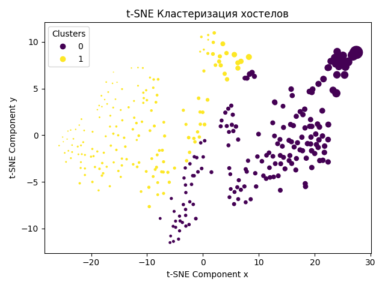

# Курсовая работа по предмету Интеллектуальные информационные системы
## Решение задачи регрессии.
### Постановка задачи:

>Предсказание рейтинга хостела (summary.score) на основе ключевых признаков цены (price.from), атмосферы (atmosphere), 
>расстоянии от центра города (Distance), чистоте (cleanliness), удобства(facilities).

### Решение основным методом:
### Описание метода:
Был использован метод лассо-регрессия, который включает регуляризацию для управления сложностью модели. Он добавляет 
штраф к функции потерь, умножая сумму абсолютных значений коэффициентов на параметр регуляризации (альфа). Это позволяет 
модели отбирать наиболее важные признаки, устанавливая веса менее важных признаков близкими к нулю.

### Итог
_На основе результатов, таких как точность модели, среднеквадратичная ошибка и коэффициент детерминации, можно сделать 
вывод о качестве предсказания модели. В данном случае, точность модели составляет 90.46%, что свидетельствует о хорошем 
качестве предсказаний. Наиболее важные признаки, влияющие на рейтинг, определены как уровень предоставляемых удобств 
(facilities), атмосфера (atmosphere) и чистота (cleanliness)._

### Решение дополнительным методом:
### Описание метода:
Программа выполняет регрессию с использованием дерева решений. Используется регрессионное дерево 
(DecisionTreeRegressor), предоставляемое библиотекой scikit-learn, для обучения модели на обучающих данных. 
Эта модель строит дерево решений, которое может предсказывать рейтинг хостела на основе указанных признаков.

Она разбивает пространство признаков на рекурсивные подмножества и присваивает каждому листу дерева предсказанное 
числовое значение. В данном случае, это числовая цена хостела.

### Итог
Модель дерева решений, обученная на данных о хостелах, продемонстрировала приемлемый результат в предсказании рейтинга
хостела на тестовом наборе данных (57.40%). Наиболее важные признаки, влияющие на рейтинг, определены как 
уровень предоставляемых удобств (facilities), атмосфера (atmosphere) и чистота (cleanliness).

## Вывод

## Решение задачи кластеризации.
### Постановка задачи:

> Кластеризацию хостелов на основе признака расстояния от центра города и их рейтинга по разным показателям таких как 
> общая оценка, удобство, чистота, локация, безопасность, персонал, атмосфера, цена денег и выбрать наиболее влиятельные 
> признаки из данных. 

### Решение основным методом:
### Описание метода:
В представленном коде использован метод t-SNE (t-distributed Stochastic Neighbor Embedding) для визуализации данных в 
двумерном пространстве. t-SNE является методом многомерного шкалирования, который позволяет снизить размерность данных, 
сохраняя при этом структуру и относительные расстояния между точками.
### Итог
В результате кластеризации два кластера выделены на графике t-SNE.
Кластер 0 имеет высокие оценки по всем характеристикам, включая высокую стоимость и большое расстояние от центра.
Кластер 1 также имеет высокие цены, но меньшее расстояние от центра, и оценки по некоторым характеристикам немного ниже 
по сравнению с кластером 0.
Полученный график:

Самым интересным и результирующим признаком оказался Distance, потому что только этот параметр наиболее чётко показывает 
разбиение на два кластера.

### Решение дополнительным методом:
### Описание метода:
Для решения задачи кластеризации данных был использован метод Self-Organizing Map (SOM), который является частным 
случаем нейронных сетей. Этот метод позволяет организовать данные в пространстве таким образом, чтобы схожие образцы 
находились близко друг к другу на двумерной карте. В процессе обучения SOM формирует кластеры, которые могут отражать 
структуру и особенности данных.
### Итог
Self-Organizing Map позволил эффективно кластеризовать данные, выделяя группы схожих образцов. Поскольку, в отличие 
от основного метода мы использовали нейронную сеть то и отображение на графике, как и решение поставленной задачи в 
целом отличается от решения основного метода.
Вот пример построенного графика:

Чем более тёмный кластер, тем большая группа образовалась на этом месте. Всего было выделено 100 кластеров (0-99) И из 
них можно выделить 3 основных: 

Вот три самых результирующих признака:

## Вывод
_Сравнив два метода можно сделать вывод, что оба метода подходят для выделения групп. В случае первого метода группы были 
выделены в основном из-за признака основанном на дистанции от центра города. Во втором методе по трём признакам 
дистанция, удобство и чистота. В обоих случая дистанция была ключевым признаком для разделения данных на группы._ 

_Данные методы очень полезны в случае если вы хотите открыть свой хостел, и вам нужно выбрать место. Эти методы показывают 
где и на каком расстоянии находятся большинство хостелов, опираясь так же на их рейтинг._

---

